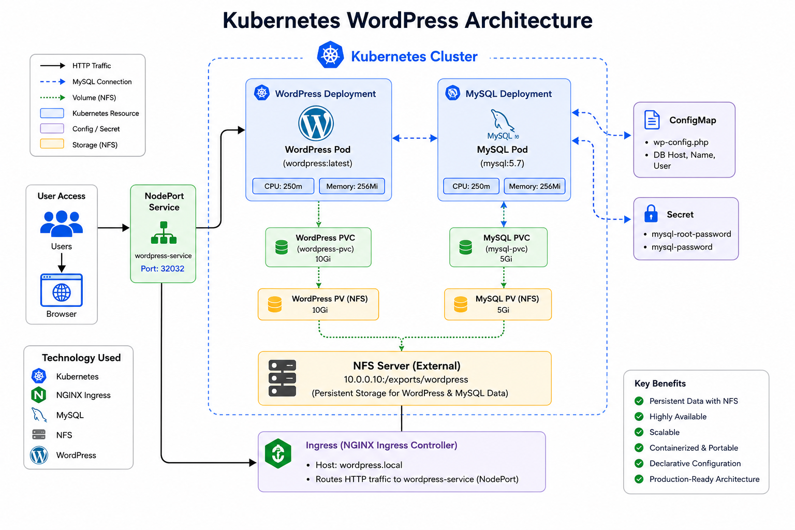
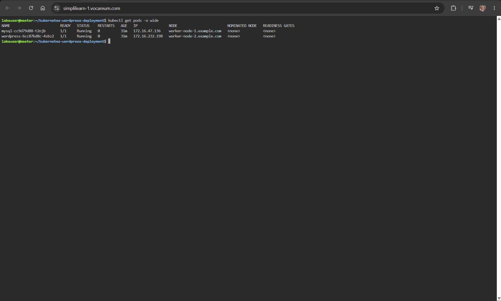
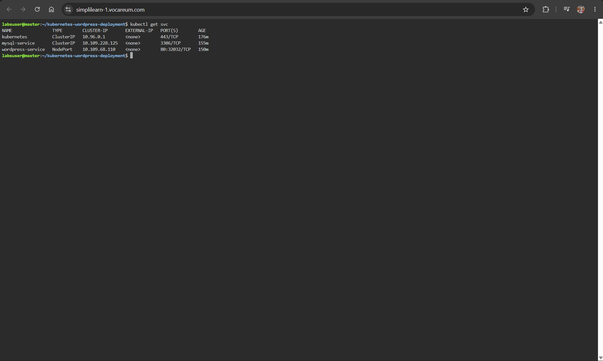
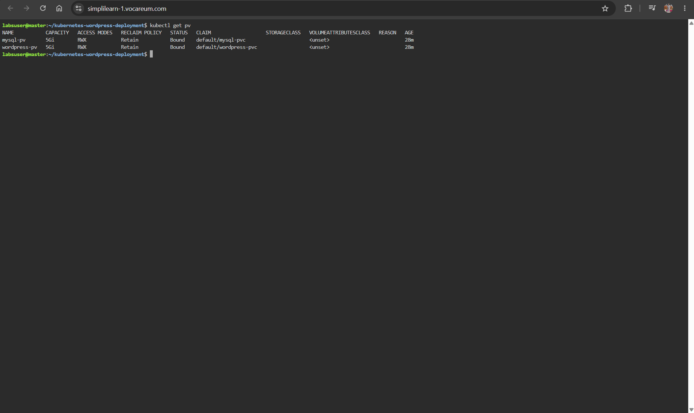
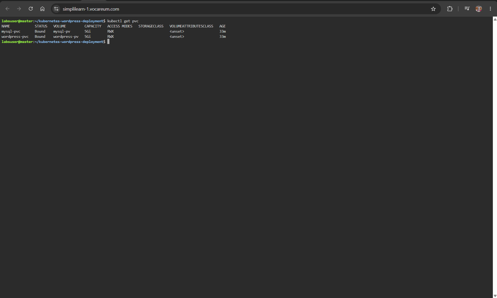
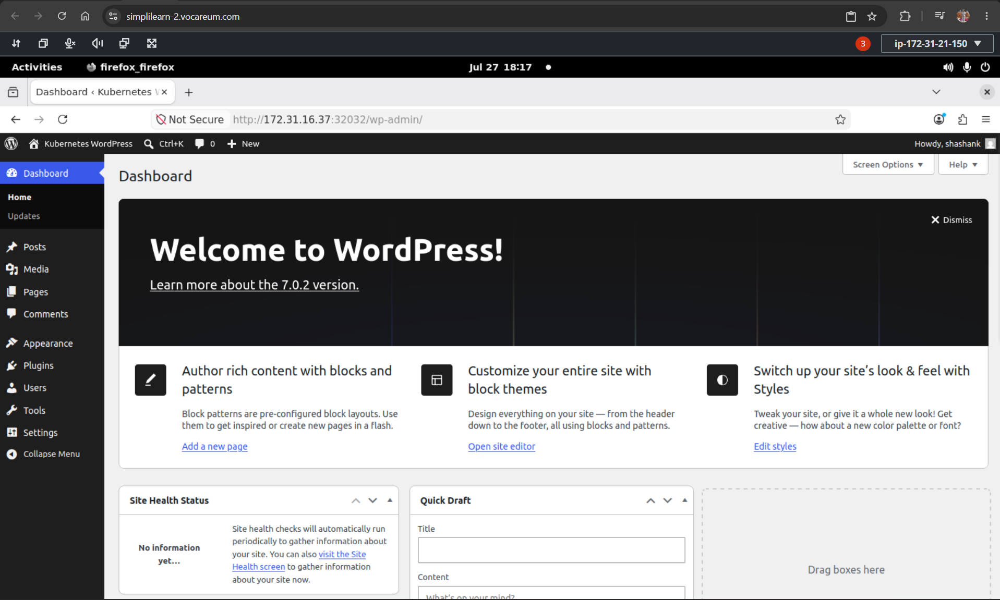
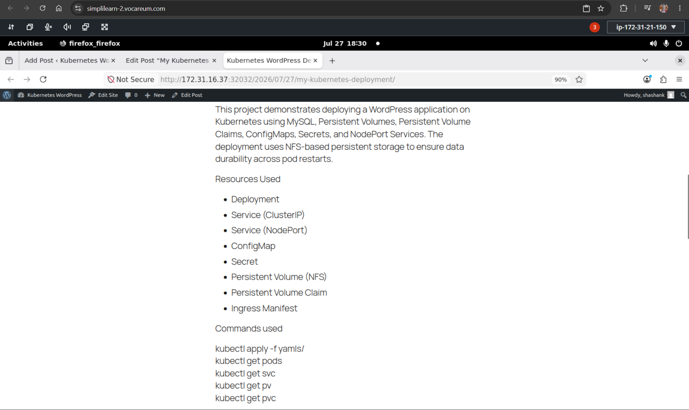
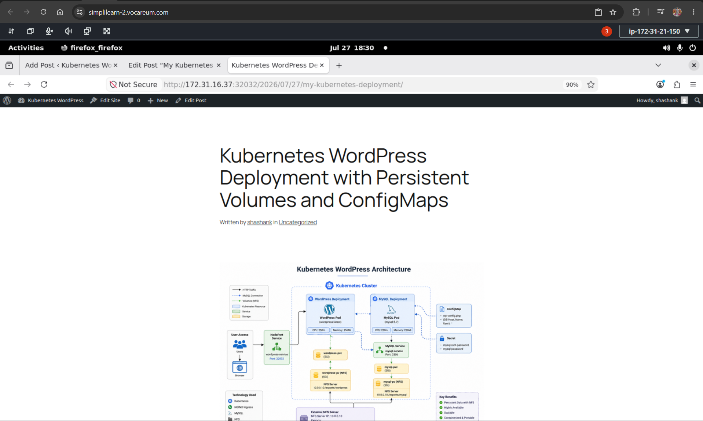

# 🚀 Kubernetes WordPress Deployment

<p align="center">


</p>

A production-inspired **Kubernetes project** demonstrating the deployment of a **WordPress** application with a **MySQL backend** using modern Kubernetes best practices.

This project showcases production-style Kubernetes concepts including Deployments, Services, ConfigMaps, Secrets, Persistent Storage, Resource Management, and Ingress while deploying a complete stateful web application.

---

# 📌 Project Status

✅ Completed

A fully functional Kubernetes deployment featuring persistent storage, secure configuration management, and production-inspired architecture.

# 📚 Table of Contents

- [Project Overview](#-project-overview)
- [Quick Start](#-quick-start)
- [Architecture](#-architecture)
- [Features](#-features)
- [Technology Stack](#-technology-stack)
- [Prerequisites](#-prerequisites)
- [Project Structure](#-project-structure)
- [Kubernetes Resources Used](#-kubernetes-resources-used)
- [How It Works](#-how-it-works)
- [Deployment](#-deployment)
- [Screenshots](#-screenshots)
- [Skills Demonstrated](#-skills-demonstrated)
- [Learning Outcomes](#-learning-outcomes)
- [Troubleshooting](#-troubleshooting)
- [Future Improvements](#-future-improvements)
- [Author](#-author)
- [License](#-license)

---
# 📖 Project Overview

This project demonstrates the deployment of a **stateful WordPress application** on Kubernetes using declarative YAML manifests and production-inspired Kubernetes practices.

The application consists of:

- 🌐 WordPress Frontend
- 🗄️ MySQL Backend
- 📦 Kubernetes Deployments
- 🔐 Kubernetes Secrets
- ⚙️ ConfigMaps
- 💾 Persistent Volumes (PV)
- 📁 Persistent Volume Claims (PVC)
- 🖥️ NFS Persistent Storage
- 🌍 ClusterIP & NodePort Services
- 🚦 Ingress Resource
- 📊 Resource Requests & Limits

The objective of this project is to simulate how a real-world Kubernetes application is deployed while following recommended Kubernetes resource organization and configuration practices.

---
# ⚡ Quick Start

Clone the repository:

```bash
git clone https://github.com/Shashankj053/kubernetes-wordpress-deployment.git
```

Move into the project directory:

```bash
cd kubernetes-wordpress-deployment
```

Deploy all manifests:

```bash
kubectl apply -f yamls/
```

Verify the deployment:

```bash
kubectl get pods
kubectl get svc
kubectl get pv
kubectl get pvc
```

---
# 🏗️ Architecture

<p align="center">

</p>

The application follows a typical production-inspired Kubernetes architecture:

- Users access the application through a **NodePort Service**
- WordPress communicates with MySQL using a **ClusterIP Service**
- Configuration is managed with **ConfigMaps**
- Credentials are stored securely in **Secrets**
- Persistent data is stored on **NFS-backed Persistent Volumes**
- Deployments ensure Pods are recreated automatically if failures occur

---
# ✨ Features

- 🚀 Deploys a complete WordPress + MySQL application on Kubernetes
- 📦 Uses Kubernetes Deployments for workload management
- 💾 Persistent storage using NFS-backed Persistent Volumes
- 📁 Persistent Volume Claims for dynamic storage allocation
- ⚙️ ConfigMaps for application configuration
- 🔐 Secrets for secure database credentials
- 🌐 ClusterIP Service for internal MySQL communication
- 🌍 NodePort Service for external WordPress access
- 🚦 Ingress manifest for HTTP routing
- 📊 Resource Requests & Limits for efficient resource utilization
- 📜 Fully declarative YAML manifests
- 🛠 Production-inspired Kubernetes project structure

---
# 🛠 Technology Stack

| Category | Technologies |
|----------|--------------|
| Container Orchestration | Kubernetes |
| Container Runtime | Docker |
| Application | WordPress |
| Database | MySQL |
| Storage | NFS |
| Configuration | YAML |
| Operating System | Linux |
| CLI Tools | kubectl |

---
# 📋 Prerequisites

Before deploying this project, ensure you have the following:

- Kubernetes Cluster (Single-node or Multi-node)
- kubectl installed and configured
- Docker images accessible by the cluster
- NFS Server configured (or another Persistent Storage solution)
- Persistent Volumes created (or a StorageClass configured)
- Basic understanding of Kubernetes resources

---
# 📁 Project Structure

```text
kubernetes-wordpress-deployment
│
├── yamls/
│   ├── mysql-config.yaml
│   ├── mysql-deployment.yaml
│   ├── mysql-pv.yaml
│   ├── mysql-pvc.yaml
│   ├── mysql-secret.yaml
│   ├── mysql-service.yaml
│   ├── wordpress-config.yaml
│   ├── wordpress-deployment.yaml
│   ├── wordpress-ingress.yaml
│   ├── wordpress-pv.yaml
│   ├── wordpress-pvc.yaml
│   └── wordpress-service.yaml
│
├── Screenshots/
│   ├── architecture.png
│   ├── kubectl-get-pods.png
│   ├── kubectl-get-services.png
│   ├── kubectl-get-pv.png
│   ├── kubectl-get-pvc.png
│   ├── wordpress-dashboard.png
│   ├── wordpress-site.png
│   └── Screenshot 2026-07-28 000029.png
│
├── LICENSE
├── .gitignore
└── README.md
```

---
# ☸ Kubernetes Resources Used

| Resource | Purpose |
|----------|---------|
| Deployment | Manages WordPress and MySQL Pods |
| Pod | Runs application containers |
| ClusterIP Service | Internal communication between WordPress and MySQL |
| NodePort Service | Exposes WordPress outside the cluster |
| ConfigMap | Stores application configuration |
| Secret | Stores sensitive database credentials |
| Persistent Volume (PV) | Provides persistent storage |
| Persistent Volume Claim (PVC) | Requests persistent storage |
| Ingress | Defines HTTP routing rules |

---
# ⚙️ How It Works

1. A user accesses the application through the **NodePort Service**.
2. Kubernetes routes the request to the **WordPress Pod**.
3. WordPress connects to the **MySQL database** using the **ClusterIP Service**.
4. Database credentials are securely retrieved from **Kubernetes Secrets**.
5. Application configuration is loaded from **ConfigMaps**.
6. WordPress and MySQL store persistent data on **NFS-backed Persistent Volumes**.
7. Kubernetes Deployments automatically recreate Pods if failures occur, ensuring high availability.

---
# 🚀 Deployment

## 1. Clone the Repository

```bash
git clone https://github.com/Shashankj053/kubernetes-wordpress-deployment.git
```

## 2. Navigate to the Project Directory

```bash
cd kubernetes-wordpress-deployment
```

## 3. Deploy Kubernetes Resources

```bash
kubectl apply -f yamls/
```

## 4. Verify the Deployment

Check the Pods:

```bash
kubectl get pods
```

Check the Services:

```bash
kubectl get svc
```

Check Persistent Volumes:

```bash
kubectl get pv
```

Check Persistent Volume Claims:

```bash
kubectl get pvc
```

If all resources are running successfully, access the WordPress application using the NodePort Service.

---
# 📸 Screenshots

## Kubernetes Pods

WordPress and MySQL Pods running successfully.



---

## Kubernetes Services

ClusterIP and NodePort Services.



---

## Persistent Volumes

Persistent Volumes configured for both applications.



---

## Persistent Volume Claims

PVCs successfully bound to their respective Persistent Volumes.



---

## WordPress Dashboard

Successful installation of WordPress.



---

## Running Website

The deployed WordPress application running successfully.



---

## Complete Deployment Verification

Final verification of Kubernetes resources.



---
# 🎯 Skills Demonstrated

This project demonstrates practical experience with:

- Kubernetes
- Docker
- Linux Administration
- WordPress Deployment
- MySQL Administration
- Kubernetes Networking
- Persistent Storage
- NFS
- ConfigMaps
- Kubernetes Secrets
- YAML Manifest Design
- Resource Requests & Limits
- Kubernetes Troubleshooting
- Production-inspired Infrastructure Design

---
# 📚 Learning Outcomes

Through this project, I gained hands-on experience with:

- Deploying stateful applications on Kubernetes
- Managing Kubernetes Deployments and Services
- Working with ConfigMaps and Secrets
- Provisioning Persistent Volumes and Persistent Volume Claims
- Configuring NFS-backed storage
- Designing declarative Kubernetes manifests
- Debugging Kubernetes networking issues
- Troubleshooting persistent storage problems
- Resolving application startup failures
- Following production-inspired Kubernetes best practices

---
# 🔧 Troubleshooting

During the development of this project, several real-world Kubernetes issues were encountered and resolved.

### Persistent Volume Issues

- Persistent Volumes remained in the **Released** state after deleting Persistent Volume Claims.
- Volumes were recreated and rebound successfully.

### Database Connection Issues

- WordPress displayed **"Error establishing a database connection"** due to stale MySQL data on the NFS volume.
- Cleaning the persistent storage allowed MySQL to initialize correctly.

### Health Probe Failures

- Initial readiness and liveness probes returned HTTP 500 errors while WordPress was starting.
- Startup configuration was adjusted to ensure stable initialization.

### Storage Initialization

- NFS-backed Persistent Volumes required cleanup before database reinitialization.
- Persistent storage was verified after successful deployment.

These troubleshooting steps provided valuable hands-on experience with Kubernetes storage management, networking, application deployment, and debugging.

---
# 🚀 Future Improvements

Potential enhancements for this project include:

- Helm Charts
- Kubernetes StatefulSets
- Horizontal Pod Autoscaler (HPA)
- GitHub Actions CI/CD Pipeline
- Argo CD GitOps Deployment
- Kustomize
- Prometheus Monitoring
- Grafana Dashboards
- NGINX Ingress Controller
- TLS using cert-manager
- Velero Backup & Restore
- ExternalDNS Integration

---
# 👨‍💻 Author

## Shashank Jain

**Bachelor of Computer Applications (Cloud Computing)**

Aspiring **DevOps Engineer** passionate about Kubernetes, Docker, Linux, AWS, CI/CD, Infrastructure Automation, and Cloud Technologies.

### Connect with Me

- **GitHub:** https://github.com/Shashankj053
- **LinkedIn:** https://www.linkedin.com/in/shashankjain053/

---
# 📄 License

This project is licensed under the **MIT License**.

See the [LICENSE](LICENSE) file for more information.

---

⭐ **If you found this project useful, consider giving it a Star on GitHub!**
